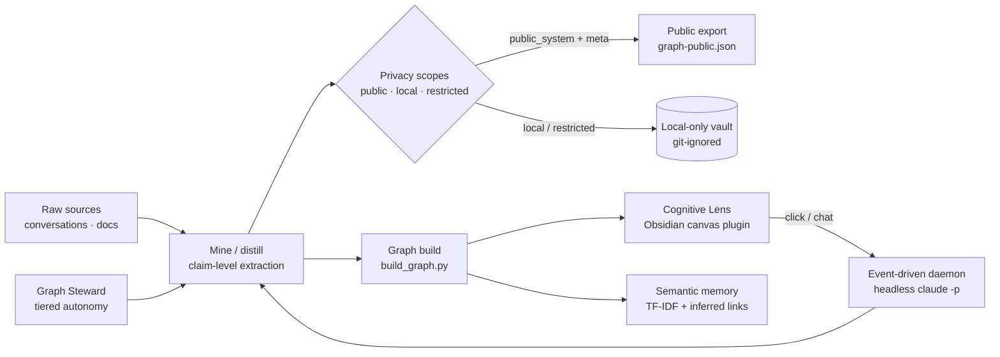

# Claude-Wiki — a self-maintaining knowledge OS (public system layer)

This is the **public system-logic layer** of a personal LLM-wiki — a persistent, self-visualizing,
self-maintaining knowledge base maintained by [Claude Code](https://claude.com/claude-code), following
Karpathy's *LLM-wiki* pattern (raw sources → an LLM-maintained wiki → a schema that governs it).

It is **not** a notes dump. It is the *engine*: the graph builder, the dual-scope privacy model, the
**Cognitive Lens** (an interactive "eye" that renders the graph and reacts to the AI in real time), the
event-driven autonomy daemon, the semantic-memory layer, and the `CLAUDE.md` "constitution" that ties them
together.

> **What this repo is — and isn't.** This is the *method*, not the work. It contains the system that makes
> up the wiki and ~18 `mode: meta` pages **about that system**. It deliberately excludes the owner's private
> knowledge, sources, conversations, and personal graph. See [`PRIVACY.md`](./PRIVACY.md). The phrase that
> governs every export: **publish the method, not the work.**

It's the companion to the paper on *horizontal scaling* — the idea that a compute-constrained builder gains
capability by **composing systems** (memory, tools, graphing, privacy, governance) around a model, not by
training a bigger one. This repo is that claim, running.

---

## Architecture



- **Capture → distill.** Conversations and docs are mined into claim-level wiki pages.
- **Privacy scopes.** Every node is `public_system`, `local_private`, or `restricted_private`. Only
  `public_system + mode: meta` is ever exported. Default (omitted) = local. The line is enforced in code.
- **Graph build.** `build_graph.py` derives a graph from YAML frontmatter + `[[wikilinks]]`, in two scopes.
- **Cognitive Lens.** An Obsidian canvas plugin renders the graph as a living "eye" that focuses on the
  active goal, pulses pipelines, and crystallizes new knowledge as the AI works.
- **Autonomy.** An event-driven daemon turns each click/chat into a headless `claude -p` run; a tiered
  **Graph Steward** writes low-risk growth automatically and quarantines anything risky.
- **Memory.** A TF-IDF semantic index + inferred links give retrieval that goes beyond keywords.

---

## What's included / what stays private

| Included (the system) | Excluded (stays local) |
|---|---|
| `CLAUDE.md` — the operating schema / constitution | The owner's private knowledge graph (`graph-local.json`) |
| `07_visualizer/build_graph.py` — dual-scope graph builder | Raw conversations & sources (`01_raw/`) |
| `07_visualizer/wiki-eye-plugin/` — the Cognitive Lens | `restricted/` + `local/` private pages |
| `tools/` — export, privacy enforcement, retrieval, bridges, daemon | The self-model spine (steers retrieval toward the owner's direction) |
| `.claude/commands/` — the executable command surface | The capture/ingestion plumbing (session/import/mobile) |
| ~18 `mode: meta` pages **about the system** | Everything domain-derived, even if generalizable |

---

## Quickstart

> This is a **reference + methodology release**. To run it live you point it at your own Obsidian vault;
> it is meant to be read and adapted, not deployed turnkey.

```bash
git clone https://github.com/<your-username>/claude-wiki-public && cd claude-wiki-public

# 1. Build the dual-scope graph (standard library only)
python3 07_visualizer/build_graph.py --scope both

# 2. Install the Cognitive Lens into an Obsidian vault, then reload Obsidian and enable "Wiki Eye"
python3 tools/install_eye_plugin.py

# 3. (optional) Semantic memory layer
pip install scikit-learn numpy scipy
python3 tools/semantic_index.py --build

# 4. (optional) Event-driven autonomy daemon (systemd user service)
cp tools/lens-daemon.service ~/.config/systemd/user/
systemctl --user daemon-reload && systemctl --user enable --now lens-daemon.service
```

The command surface (`/ingest`, `/query`, `/prime`, `/study`, `/steward-pending`, `/chat`, …) lives in
`.claude/commands/` and runs inside Claude Code started from the vault.

---

## Implementation status

**Shipped here (runnable):** the graph engine, the Cognitive Lens plugin, the dual-scope privacy/export
machinery, the semantic-memory + inferred-link retrieval, the live AI→Lens bridges, the event-driven
autonomy daemon + steward cron, spaced-repetition review, the full command surface, and `CLAUDE.md`.

**Described in the docs/commands but kept local (not in this public release):** the capture/ingestion
plumbing (session capture, chat import, mobile upload), and the **self-model spine** (a living model of the
owner's goals/skills/direction that steers retrieval and capture) — these are inherently personal, so they
stay on the owner's machine. Commands that reference them still document the design.

---

## License

Dual-licensed: **code** under [MIT](./LICENSE); **written methodology** (the `.md` pages) under
[CC BY 4.0](./LICENSE-docs.md). See each file.

🤖 Built and maintained with [Claude Code](https://claude.com/claude-code).
