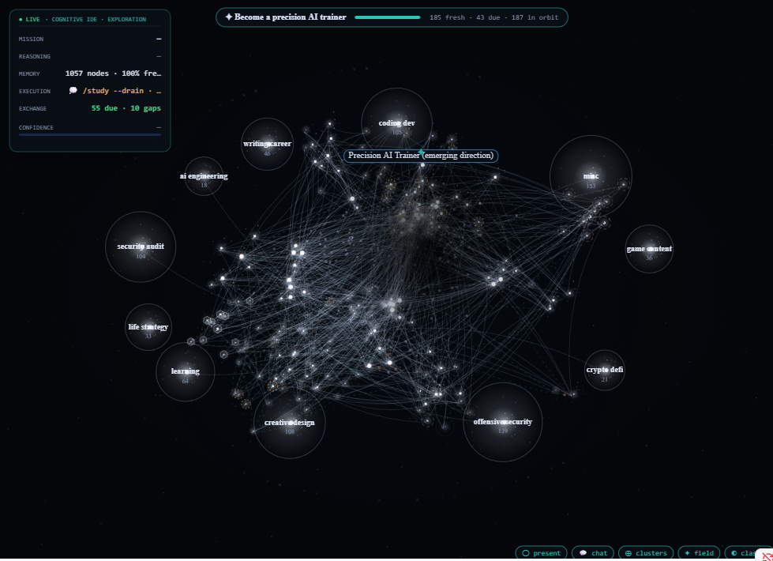
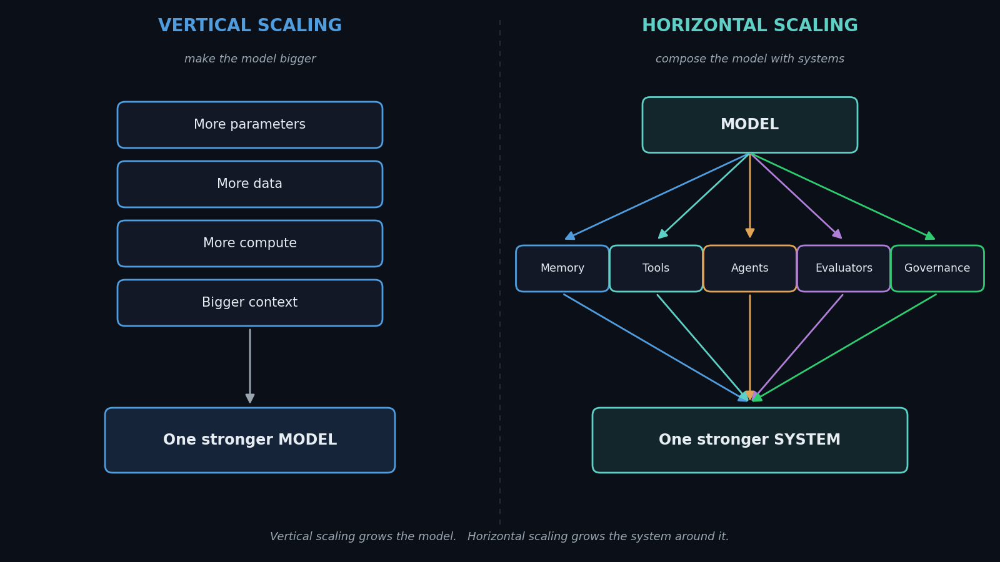

[📄 Read the paper](PAPER.html) &nbsp;·&nbsp; [🔒 Privacy model](PRIVACY.html) &nbsp;·&nbsp; [💻 Source on GitHub](https://github.com/dumbbutt0/claude-wiki-public)

## A self-maintaining knowledge OS

This is the **public system layer** of a personal LLM-wiki — a persistent, self-visualizing,
self-maintaining knowledge base maintained by [Claude Code](https://claude.com/claude-code), following
Karpathy's *LLM-wiki* pattern (raw sources → an LLM-maintained wiki → a schema that governs it).

It's the companion to the paper on **horizontal scaling** — the idea that a compute-constrained builder
gains capability by *composing systems* (memory, tools, graphing, privacy, governance) around a model,
rather than by training a bigger one. This site is that claim, running.

> **Publish the method, not the work.** Everything here is the *system* and the pages *about* the system —
> never the owner's private knowledge, sources, conversations, or personal graph. See the
> [privacy model](PRIVACY.html).

### Explore

- **[The paper — Horizontal Scaling in AI Systems](PAPER.html)**
- **[How the privacy model works](PRIVACY.html)**
- **[The full system + code on GitHub](https://github.com/dumbbutt0/claude-wiki-public)**

---

Built and maintained with Claude Code · code under MIT, writing under CC BY 4.0.
